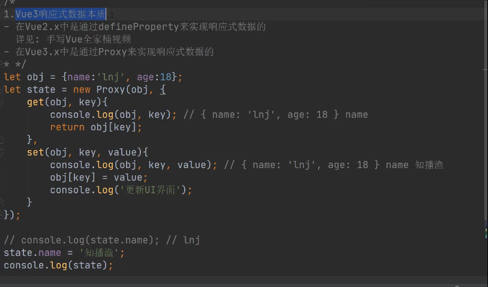

# 安装 vue
- 安装Vite
    npm install -g create-vite-app
- 利用Vite创建Vue3项目
    create-vite-app ProjectName
- 安装依赖运行项目
    cd projectName
    npm install

# ref
- 定义可监听的 变量  eg `let count = ref(0) `
- 当我们给ref函数传递一个值得 时候，相当于reactive({value:0}),所以修改值得的时候需要.value 
- 如果 在template 使用ref 的类型数据 那么vue 是自动天骄.value
- 如果在template 使用reactive 的类型数据 没那么 vue 不会自动添加.value
- Vue 是如何 决定自动添加.value 
- vue 解析前会自动判断这个数据 是否是ref 类型的数据
- 通过当前的数据__v_ref 来判断的
- 如果这个私有属性 并且为true 就是ref属性
- 

# reactive
`setup(){
    let state =reactive({age:12});
    state.age =22;
    return {state}
}`
# vue 递归监听

# shallowReactive shallowRef triggerRef 

# toRaw 
- 使ref reactive （proxy）的数据 返回原始数据 ，如果不会更新ui界面 可以使用 这样性能就好 了
# markRaw
# toRef
- 修改响应式数据 会修改以前的数据
- 如果想让响应式数据跟以前的数据的关联起来
# custumRef

# readonly 用于创建一个只读的数据 shallowReadonly 非递归只读

# vue3.0 响应原理

